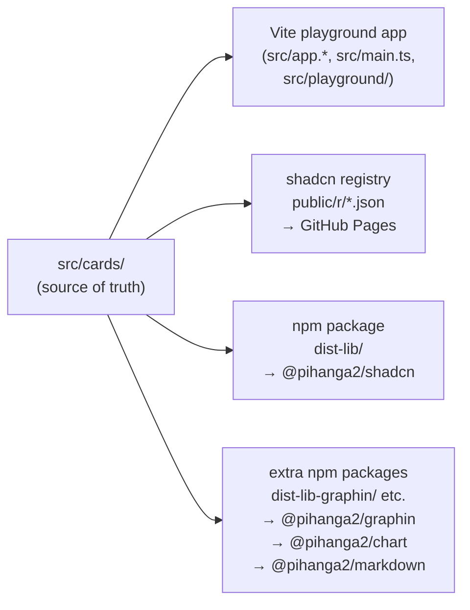

# pihanga-shadcn

A collection of **Pihanga cards** built on top of [shadcn/ui](https://ui.shadcn.com/) and
[Radix UI](https://radix-ui.com/), distributed through two channels: a
**shadcn copy-on-install registry** and traditional **npm packages**.

| npm package | Contents | Install |
|---|---|---|
| `@pihanga2/shadcn` | Core cards (Radix UI + light deps only) | `npm install @pihanga2/shadcn` |
| `@pihanga2/graphin` | Network graph card (`@antv/graphin`) | `npm install @pihanga2/graphin` |
| `@pihanga2/chart` | Chart card (`recharts`) | `npm install @pihanga2/chart` |
| `@pihanga2/markdown` | Markdown viewer (mermaid, remark, rehype) | `npm install @pihanga2/markdown` |

**New here? Start with the getting-started guide:**
→ [AGENTS.getting-started.md](./AGENTS.getting-started.md) — scaffold a new app from scratch (Vite, shadcn/ui, pihanga-core, initial file layout)

**For users of the cards** (install, wire, build apps):
→ [USER_GUIDE.md](./USER_GUIDE.md) · [AGENT.md](./AGENT.md) (AI assistants)

> 💬 **Found a bug, a missing card, or have a suggestion?**
> Please open an issue at **https://github.com/ivcap-works/pihanga-shadcn/issues**
> — card requests, integration problems, and documentation improvements are all
> very welcome.

---

## Table of Contents

- [Getting started](#getting-started)
- [Stack](#stack)
- [This repo: dual playground + card library](#this-repo-dual-playground--card-library)
- [Project structure](#project-structure)
- [Development commands](#development-commands)
- [Distribution channels](#distribution-channels)
  - [Registry (Option D) — `make gen-registry`](#registry-option-d--make-gen-registry)
  - [npm package — `@pihanga2/shadcn` (core)](#npm-package--pihanga2shadcn-core)
  - [Extra npm packages — graphin, chart, markdown](#extra-npm-packages--graphin-chart-markdown)
- [Managing the core-cards allowlist](#managing-the-core-cards-allowlist)
  - [When to include a card in the npm package](#when-to-include-a-card-in-the-npm-package)
  - [When to keep a card registry-only](#when-to-keep-a-card-registry-only)
- [Adding a new card](#adding-a-new-card)
- [Adding shadcn/ui primitives](#adding-shadcnui-primitives)
- [Available cards](#available-cards)
- [Publishing to npm](#publishing-to-npm)
  - [Step 1 — Create the @pihanga2 npm organisation](#step-1--create-the-pihanga2-npm-organisation)
  - [Step 2 — Authenticate your CLI](#step-2--authenticate-your-cli)
  - [Step 3 — Verify publish access](#step-3--verify-publish-access)
  - [Step 4 — Dry run](#step-4--dry-run)
  - [Step 5 — Build and publish](#step-5--build-and-publish)
  - [Bumping the version](#bumping-the-version)

---

## Getting started

If you are building a **new app** that uses pihanga-shadcn cards, follow these steps in order:

1. **Scaffold a Vite + React + TypeScript project**

   ```sh
   npm create vite@latest my-app -- --template react-ts
   cd my-app && npm install
   ```

2. **Install shadcn/ui** (creates `components.json`, Tailwind, path aliases)

   ```sh
   npx shadcn@latest init   # choose: New York · Neutral · CSS variables = Yes
   # yarn users: yarn dlx shadcn@latest init
   ```

   > ⚠️ **Node 24 / npm 11 users:** `npx shadcn@latest` fails on this combination.
   > Use `nvm use 22` or replace `npx` with `yarn dlx`.

3. **Install pihanga-core**

   ```sh
   npm install @pihanga2/core
   ```

4. **Add cards** via the registry or npm package

   ```sh
   # Registry — copies editable source into src/cards/
   npx shadcn@latest add https://ivcap-works.github.io/pihanga-shadcn/r/framework.json
   npx shadcn@latest add https://ivcap-works.github.io/pihanga-shadcn/r/pageWithNavbar.json
   # … add more cards as needed

   # npm package alternative — no shadcn CLI required
   npm install @pihanga2/shadcn
   ```

5. **Wire up the initial file layout**

   Create five files using the templates in the full guide:

   | File | Purpose |
   |---|---|
   | `src/app.types.ts` | Error envelope type definitions |
   | `src/app.state.ts` | Redux state shape (`AppState`) |
   | `src/app.pihanga.ts` | `registerFramework` + `registerCard` declarations |
   | `src/app.reducer.ts` | External event handlers — `register()` + `on*` helpers |
   | `src/main.ts` | Entry point — `start()` call |

   Copy `src/app.root.tsx` from the
   [`example/src/`](https://github.com/ivcap-works/pihanga-shadcn/tree/main/example/src)
   directory — it wires the Redux `<Provider>` and Sonner `<Toaster>`.

   > **Quick start:** the [`example/`](./example) directory in this repo is a
   > complete, runnable counter app that demonstrates all five files.
   > Run it with `cd example && yarn install && yarn dev`.

**→ Full step-by-step guide (Vite config, Tailwind theme, file layout, code examples):**
[AGENTS.getting-started.md](./AGENTS.getting-started.md)

Once your scaffold is in place, see [AGENT.using-cards.md](./AGENT.using-cards.md) for
installing more cards, wiring `memo()`, multi-page navigation, and the Card API quick
reference.

---

## Stack

| Layer | Tool |
|---|---|
| Card framework | [@pihanga2/core](https://github.com/ivcap-works/pihanga) — declarative card system + Redux |
| Build | [Vite](https://vite.dev/) v8 |
| UI | [React](https://react.dev/) v19 |
| Language | [TypeScript](https://www.typescriptlang.org/) ~5.8 |
| Styling | [Tailwind CSS](https://tailwindcss.com/) v4 |
| Components | [shadcn/ui](https://ui.shadcn.com/) (new-york) + [Radix UI](https://www.radix-ui.com/) |
| Icons | [Lucide React](https://lucide.dev/) |
| Linting | ESLint v9 (flat config) + typescript-eslint |
| Testing | Vitest + Testing Library |

---

## This repo: dual playground + card library

This repository serves **two separate audiences** from the same source tree:



| Concern | Lives in | Relevant to |
|---|---|---|
| Playground / demo app | `src/app.*`, `src/main.ts`, `src/playground/` | **Contributors only** — not shipped to users |
| Card implementations | `src/cards/<name>/` | Both channels |
| shadcn UI primitives | `src/components/ui/` | Both channels (read-only; managed by shadcn CLI) |
| Shared hooks / utils | `src/components/hooks/`, `src/lib/` | Both channels |
| Registry JSON | `public/r/` (generated) | Registry users |
| npm bundle | `dist-lib/` (generated) | npm users |

**The playground is an internal development tool** — it is not something consumers of the cards
interact with, and it is not shipped in either distribution channel.

---

## Project structure

```
src/
├── cards/                    # Card library — one folder per card
│   ├── <cardName>/
│   │   ├── index.ts          # Registration + re-exports
│   │   ├── <card>.types.ts   # ID, Props, Events, action wiring
│   │   ├── <card>.component.tsx
│   │   ├── <card>.example.ts # Playground demo (not shipped)
│   │   └── dependencies.json # Per-card npm dep declarations
│   └── BUILDING_CARDS_HOWTO.md
├── components/
│   └── ui/                   # shadcn/ui primitives (auto-managed — do not edit)
├── lib/utils.ts              # cn() and shared utilities
├── playground/               # ← contributor/dev only
├── app.*                     # ← contributor/dev only
└── main.ts                   # ← contributor/dev only

scripts/
├── core-cards.json           # npm package allowlist (edit to add/remove cards)
├── build-core.mjs            # npm package build orchestrator
├── gen-registry.mjs          # shadcn registry generator
└── gen-card-dependencies.mjs # per-card dependency scanner

public/r/                     # generated registry JSON (committed to git)
dist-lib/                     # generated npm package (git-ignored)
vite.config.ts                # playground dev/build config
vite.lib.config.ts            # npm library build config
```

---

## Development commands

```sh
yarn install          # install dependencies (also: make install)

make dev              # start playground dev server
make build            # build playground production bundle → dist/
make check            # lint + type-check + tests (CI gate)
make test             # run tests (watch mode)
make test-run         # run tests once
make type-check       # TypeScript type checking
make lint             # ESLint
make lint-fix         # ESLint auto-fix
make clean            # remove dist/, dist-lib/, coverage/
```

---

## Distribution channels

Both channels are generated from the same `src/cards/` source and are
**independent** — updating one does not affect the other.

### Registry (Option D) — `make gen-registry`

Generates shadcn-compatible JSON files into `public/r/`.  Commit the output;
GitHub Pages serves it at `https://ivcap-works.github.io/pihanga-shadcn/r`.

```sh
make gen-registry                                    # regenerate all public/r/*.json
node scripts/gen-registry.mjs --dry-run             # preview without writing
node scripts/gen-registry.mjs --base-url http://localhost:5173  # local testing
```

Run this whenever you:
- add a new card
- rename any file in `src/cards/`
- change a card's dependencies

All cards (including the heavy ones) are included in the registry.

### npm package — `@pihanga2/shadcn` (core)

Builds `@pihanga2/shadcn` into `dist-lib/` using Vite library mode.
Only the **core cards subset** (defined in `scripts/core-cards.json`) is included.

```sh
make build-core          # full build → dist-lib/
make build-core-dry      # dry-run: preview generated files without writing
make publish             # build-core + npm publish --access public
```

The build pipeline (orchestrated by `scripts/build-core.mjs`):
1. Reads `scripts/core-cards.json` for the card allowlist
2. Generates `src/cards/core-index.ts` (auto-generated barrel — do not commit)
3. Runs `vite build --config vite.lib.config.ts` → `dist-lib/cards/*/index.js`
4. Aggregates dependencies from each core card's `dependencies.json`
5. Writes `dist-lib/package.json` with full exports map and `sideEffects` list
6. Writes `dist-lib/README.md`

---

### Extra npm packages — graphin, chart, markdown

Cards with heavy optional dependencies are published as **separate packages** so
consumers who don't use them avoid the install overhead.

| Package | Output dir | Key deps |
|---|---|---|
| `@pihanga2/graphin` | `dist-lib-graphin/` | `@antv/g`, `@antv/g6`, `@antv/graphin` |
| `@pihanga2/chart` | `dist-lib-chart/` | `recharts` |
| `@pihanga2/markdown` | `dist-lib-markdown/` | `mermaid`, `react-markdown`, `remark-*`, `rehype-*` |

All three are built by the same orchestration script (`scripts/build-extras.mjs`) using
a single parameterised Vite config (`vite.extras.config.ts`). The package registry is
`scripts/extra-packages.json` — add an entry there to define a new extra package.

```sh
# Build all three extra packages at once
make build-extras

# Build and preview without writing files (dry-run)
make build-extras-dry

# Build a single extra package
make build-graphin
make build-chart
make build-markdown

# Publish a single extra package
make publish-graphin
make publish-chart
make publish-markdown
```

Usage in a consumer app:
```ts
import "@pihanga2/graphin/cards/graphin";
import "@pihanga2/chart/cards/chart";
import "@pihanga2/markdown/cards/markdownViewer";
```

---

## Managing the core-cards allowlist

`scripts/core-cards.json` is the **single source of truth** for which cards appear
in the npm package.  Edit it to add or remove cards; the build picks up the change
automatically.

```json
{
  "cards": ["badge", "button", "dialog", ...],
  "excludeReason": {
    "graphin": "heavy AntV deps — ~5 MB install",
    ...
  }
}
```

### When to include a card in the npm package

Include a card if **all** of the following are true:

- Its `dependencies.json` contains only **Radix UI packages** and/or widely-used
  light utilities (`clsx`, `lucide-react`, `class-variance-authority`, `sonner`,
  `tailwind-merge`, `radix-ui`).
- No single dependency is larger than ~500 kB installed.
- The card is likely to be useful to the majority of apps adopting `@pihanga2/shadcn`.

### When to keep a card registry-only

Exclude a card from the npm package (registry-only) when it brings:

| Indicator | Examples | Action |
|---|---|---|
| Heavy optional dep (>1 MB) | `@antv/g6`, `mermaid`, `react-resizable-panels` | Exclude — add to `excludeReason` |
| Niche / specialised dep | `react-json-view-lite`, `rehype-*`, `remark-*` | Exclude unless broadly needed |
| Dep that duplicates a peer | Another React rendering library | Exclude |

Current excluded cards and their reasons are documented in `scripts/core-cards.json`
under `"excludeReason"`.

> **Rule of thumb:** if installing `@pihanga2/shadcn` would surprise a developer
> who only wants badge + button + form by downloading a graph visualisation library,
> that card does not belong in the npm package.

---

## Adding a new card

1. Create `src/cards/<name>/` with `index.ts`, `*.types.ts`, `*.component.tsx`,
   `dependencies.json`, `*.example.ts`.
2. Run `yarn gen-card-deps` to auto-populate `dependencies.json`.
3. Run `make gen-registry` to emit the registry JSON.
4. **Decide on npm inclusion:** if the card's deps qualify (see above), add its name
   to the `"cards"` array in `scripts/core-cards.json`.  Run `make build-core-dry`
   to verify the generated `package.json` looks correct.
5. Check `make check` passes.

See `USER_GUIDE.md` Part 2 and `AGENT.building-cards.md` for the full card-creation
walkthrough.

---

## Adding shadcn/ui primitives

`src/components/ui/` is managed exclusively by the shadcn CLI — **never edit files there manually**.

```sh
npx shadcn@latest add button
npx shadcn@latest add tooltip
```

After adding a new primitive, run `yarn gen-card-deps` on any card that uses it so
its `dependencies.json` stays accurate.

---

## Available cards

| Card | Registry ID | npm import | Notes |
|---|---|---|---|
| badge | `/r/badge` | `/cards/badge` | |
| box | `/r/box` | `/cards/box` | |
| button | `/r/button` | `/cards/button` | |
| checkbox | `/r/checkbox` | `/cards/checkbox` | |
| conditional | `/r/conditional` | `/cards/conditional` | |
| dataTable | `/r/dataTable` | `/cards/dataTable` | |
| dialog | `/r/dialog` | `/cards/dialog` | |
| dropDownMenu | `/r/dropDownMenu` | `/cards/dropDownMenu` | |
| field | `/r/field` | `/cards/field` | |
| flexGrid | `/r/flexGrid` | `/cards/flexGrid` | |
| form | `/r/form` | `/cards/form` | |
| framework | `/r/framework` | `/cards/framework` | App root |
| graphin | `/r/graphin` | `@pihanga2/graphin/cards/graphin` | ⚠️ Separate package |
| input | `/r/input` | `/cards/input` | |
| jsonViewer | `/r/jsonViewer` | `/cards/jsonViewer` | |
| chart | `/r/chart` | `@pihanga2/chart/cards/chart` | ⚠️ Separate package |
| list | `/r/list` | `/cards/list` | |
| loadingOverlay | `/r/loadingOverlay` | `/cards/loadingOverlay` | |
| loadingSkeleton | `/r/loadingSkeleton` | `/cards/loadingSkeleton` | |
| markdownViewer | `/r/markdownViewer` | `@pihanga2/markdown/cards/markdownViewer` | ⚠️ Separate package |
| menu | `/r/menu` | `/cards/menu` | |
| modeToggle | `/r/modeToggle` | `/cards/modeToggle` | |
| navbarSearch | `/r/navbarSearch` | `/cards/navbarSearch` | |
| pageWithNavbar | `/r/pageWithNavbar` | `/cards/pageWithNavbar` | |
| pasteTarget | `/r/pasteTarget` | `/cards/pasteTarget` | |
| resizable | `/r/resizable` | `/cards/resizable` | |
| select | `/r/select` | `/cards/select` | |
| stack | `/r/stack` | `/cards/stack` | |
| stepper | `/r/stepper` | `/cards/stepper` | |
| switch | `/r/switch` | `/cards/switch` | |
| tabs | `/r/tabs` | `/cards/tabs` | |
| textField | `/r/textField` | `/cards/textField` | |
| toast | `/r/toast` | `/cards/toast` | |
| toggleGroup | `/r/toggleGroup` | `/cards/toggleGroup` | |
| typography | `/r/typography` | `/cards/typography` | |

Registry base URL: `https://ivcap-works.github.io/pihanga-shadcn/r`

npm packages:
- `@pihanga2/shadcn` — core cards (`@pihanga2/shadcn/cards/<name>`)
- `@pihanga2/graphin` — graph card (`@pihanga2/graphin/cards/graphin`)
- `@pihanga2/chart` — chart card (`@pihanga2/chart/cards/chart`)
- `@pihanga2/markdown` — markdown card (`@pihanga2/markdown/cards/markdownViewer`)

---

## Publishing to npm

The build pipelines for all packages are **fully implemented**. Follow these
steps whenever you need to publish a new release to https://www.npmjs.com/.

### Step 1 — Create the @pihanga2 npm organisation

> Skip this step if the `@pihanga2` org already exists on npm (e.g. because
> `@pihanga2/core` or `@pihanga2/cards` have already been published).

1. Go to https://www.npmjs.com/org/create
2. Sign in (or create a free npm account).
3. Set the organisation name to **`pihanga2`**.
4. Choose **"Unlimited public packages"** (free tier).

If the org already exists, ask the owner to add you as a `developer` or `owner`.

### Step 2 — Authenticate your CLI

```sh
npm login
```

Follow the browser-based login flow. Confirm you are authenticated:

```sh
npm whoami   # should print your npm username
```

### Step 3 — Verify publish access

```sh
npm org ls pihanga2
```

Your username should appear with a `developer` or `owner` role.

### Step 4 — Dry run

Preview exactly what will be built and what the generated `package.json` files
will contain — without writing any files or touching npm:

```sh
make build-core-dry      # preview @pihanga2/shadcn
make build-extras-dry    # preview all three extra packages at once
```

### Step 5 — Build and publish

**Core package:**
```sh
make publish             # build + npm publish @pihanga2/shadcn
```

This single command:
1. Runs `yarn install`
2. Generates `src/cards/core-index.ts` (root barrel for all core cards)
3. Runs `vite build --config vite.lib.config.ts` → output in `dist-lib/`
4. Aggregates runtime dependencies from each core card's `dependencies.json`
5. Writes `dist-lib/package.json` (exports map, peer deps, `sideEffects` list)
6. Writes `dist-lib/README.md`
7. Runs `cd dist-lib && npm publish --access public`

**Extra packages (graphin / chart / markdown):**
```sh
make publish-graphin     # build + publish @pihanga2/graphin
make publish-chart       # build + publish @pihanga2/chart
make publish-markdown    # build + publish @pihanga2/markdown
```

Or to publish all extras sequentially:
```sh
make build-extras && \
  cd dist-lib-graphin && npm publish --access public && cd .. && \
  cd dist-lib-chart   && npm publish --access public && cd .. && \
  cd dist-lib-markdown && npm publish --access public && cd ..
```

The published packages are at the version declared in the root `package.json`
(all packages share the same version number).

### Bumping the version

The published version is read from the root `package.json`. Bump it before
publishing:

```sh
npm version patch   # e.g. 0.1.0 → 0.1.1 (bug fixes)
npm version minor   # e.g. 0.1.0 → 0.2.0 (new cards / features)
npm version major   # e.g. 0.1.0 → 1.0.0 (breaking API changes)
```

Then publish:

```sh
make publish
```

Or as a one-liner for patch releases:

```sh
npm version patch && make publish
```

### Verifying the release

```sh
npm info @pihanga2/shadcn
npm info @pihanga2/graphin
npm info @pihanga2/chart
npm info @pihanga2/markdown
```
