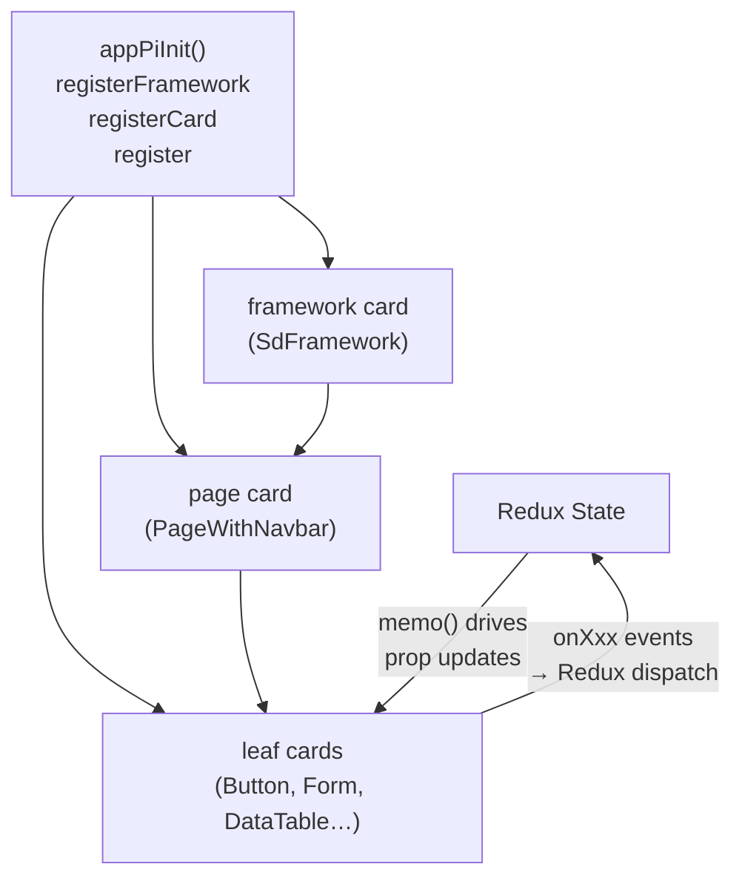
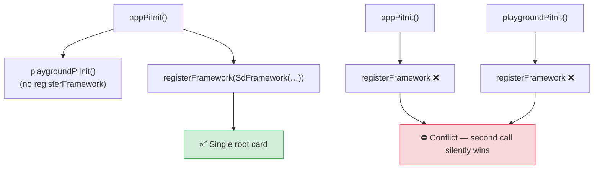
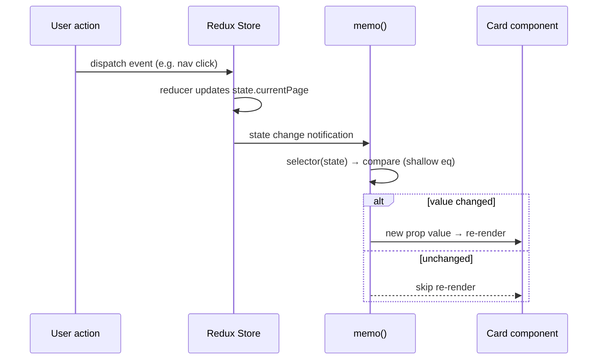
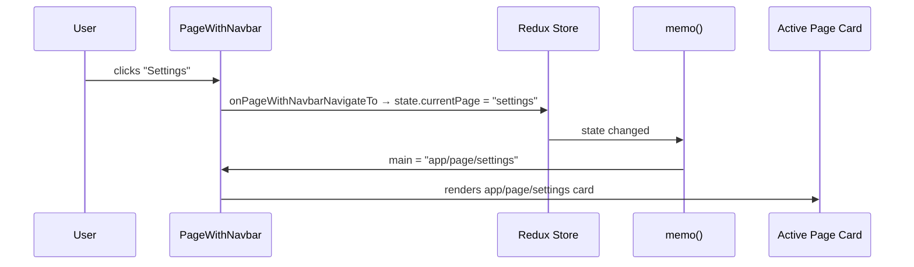
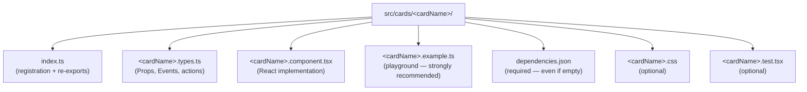
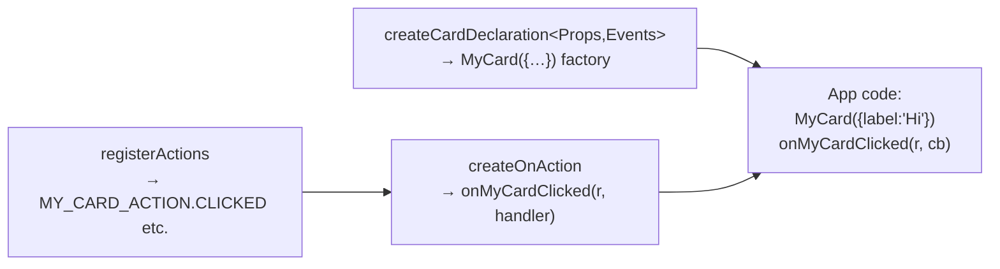

# pihanga-shadcn — User Guide

Welcome to **pihanga-shadcn**!  This guide covers everything you need — from
first-time project setup, through building multi-page apps with reactive state,
to creating your own custom card types.

| Resource | URL |
|---|---|
| Registry base URL | `https://ivcap-works.github.io/pihanga-shadcn/r` |
| npm package | `@pihanga2/shadcn` |
| Source repository | `https://github.com/ivcap-works/pihanga-shadcn` |
| **Issues / feedback** | **`https://github.com/ivcap-works/pihanga-shadcn/issues`** |

> 💬 **Found a bug, a missing card, or an unclear doc?**
> Please open an issue at the link above — card suggestions, integration
> problems, and documentation improvements are all very welcome.

---

## Table of Contents

**Part 1 — Using Cards**

- [What is pihanga-shadcn?](#what-is-pihanga-shadcn)
- [Choosing a distribution channel](#choosing-a-distribution-channel)
- [Prerequisites — one-time project setup](#prerequisites--one-time-project-setup)
- [Channel 1 — shadcn registry (copy-on-install)](#channel-1--shadcn-registry-copy-on-install)
  - [Available cards](#available-cards)
- [Channel 2 — npm package `@pihanga2/shadcn`](#channel-2--npm-package-pihanga2shadcn)
  - [Core card subset](#core-card-subset)
  - [Migrating a card from npm to a local copy](#migrating-a-single-card-from-npm-to-a-local-customised-copy)
  - [Tailwind CSS with the npm package](#tailwind-css-with-the-npm-package)
- [Bootstrapping a Pihanga app](#bootstrapping-a-pihanga-app)
  - [One `registerFramework` per app](#one-registerframework-per-app)
- [Reactive state with `memo()`](#reactive-state-with-memo)
- [Multi-page navigation with `PageWithNavbar`](#multi-page-navigation-with-pagewithnavbar)
- [`MarkdownViewer` — inline content vs. fetched file](#markdownviewer--inline-content-vs-fetched-file)
- [The `pi/button` card — links and theming](#the-pibutton-card--links-and-theming)
- [Pinning to a specific version](#pinning-to-a-specific-version)
- [Quick reference — using cards](#quick-reference--using-cards)

**Part 2 — Building Cards**

- [Hard constraints](#hard-constraints)
- [Card folder layout](#card-folder-layout)
- [Step-by-step: creating a new card](#step-by-step-creating-a-new-card)
  - [1 — Choose a card name](#1--choose-a-card-name)
  - [2 — Define Props and Events (`*.types.ts`)](#2--define-props-and-events-typests)
  - [3 — Implement the React component (`*.component.tsx`)](#3--implement-the-react-component-componenttsx)
  - [4 — Register the card (`index.ts`)](#4--register-the-card-indexts)
  - [5 — Create `dependencies.json`](#5--create-dependenciesjson)
  - [6 — Create the playground example (`*.example.ts`)](#6--create-the-playground-example-examplets)
- [Form-aware input cards](#form-aware-input-cards)
- [Real-world examples to study](#real-world-examples-to-study)
- [Publish checklist](#publish-checklist)
- [Quick reference — building cards](#quick-reference--building-cards)

---

## What is pihanga-shadcn?

`pihanga-shadcn` is a library of **Pihanga card components** built on top of
[shadcn/ui](https://ui.shadcn.com) and [Radix UI](https://radix-ui.com).

Cards are available through **two distribution channels**:

| Channel | How to install | Best for |
|---|---|---|
| **shadcn registry** | `npx shadcn@latest add <url>` | Projects already using shadcn/ui; maximum customisability |
| **npm package** | `npm install @pihanga2/shadcn` | Standard npm workflows; monorepos; CI pipelines |

Both channels use the same card source.  The registry copies source files into
your project (you own and can edit them); the npm package ships pre-built ESM
bundles.

A Pihanga app is structured around **cards** — declarative configuration
objects that describe UI widgets.  The runtime (from `@pihanga2/core`) wires
cards to Redux state and handles re-rendering automatically.



---

# Part 1 — Using Cards

---

## Prerequisites — one-time project setup

### 1 — Initialise shadcn

If your project doesn't already have shadcn configured, run:

```sh
npx shadcn@latest init
```

When prompted, choose:
- **Style**: New York
- **Base colour**: Neutral
- **CSS variables**: Yes

This creates `components.json`, patches `tsconfig.json` with the `@/` path
alias, and installs Tailwind CSS if it isn't present yet.

### 2 — Check the `@/cards` alias

Pihanga cards land in `src/cards/` and import each other via `@/cards/`.  The
`@/*` → `./src/*` mapping that `shadcn init` creates already covers this, so
**no extra alias is usually needed**.

If your cards live somewhere other than `src/cards/`, add an explicit mapping
to `tsconfig.json`:

```jsonc
// tsconfig.json → compilerOptions.paths
{
  "compilerOptions": {
    "paths": {
      "@/*":       ["./src/*"],
      "@/cards/*": ["./src/cards/*"]   // only needed if cards are NOT under src/
    }
  }
}
```

### 3 — Configure `src/index.css` (Tailwind v4 + shadcn theme)

> **⚠️ This is a Tailwind CSS project.**  Your `index.html` must **not** contain
> any `<link rel="stylesheet">` tags for external CSS frameworks (Bootstrap,
> Bulma, etc.), CDN font `<link>` tags loaded as stylesheets, or `<style>`
> blocks.  Tailwind generates all styles at build time from the utility classes
> in your source files.  Adding foreign stylesheets will conflict with
> Tailwind's generated output and break the shadcn colour variables.

Your `src/index.css` must include the full Tailwind v4 `@theme inline` block
that bridges shadcn's CSS custom properties (`--card`, `--background`, …) to
Tailwind colour utilities (`bg-card`, `bg-background`, …).  Without it,
dialog panels, popovers, and card backgrounds render as **transparent**.

**Get the reference file** by copying directly from the repository:

```sh
curl -o src/index.css \
  https://raw.githubusercontent.com/ivcap-works/pihanga-shadcn/main/src/index.css
```

or view / copy it at:
`https://github.com/ivcap-works/pihanga-shadcn/blob/main/src/index.css`

The file provides the `@theme inline` colour token mappings, light/dark CSS
variable tokens, and `scrollbar-gutter: stable` on `<body>` (to prevent layout
reflow when Radix dialogs open).  See
[AGENT.using-cards.md — step 3](./AGENT.using-cards.md#3--configure-srcindexcss-tailwind-v4--shadcn-theme)
for the full annotated listing.

---

## Choosing a distribution channel

| | Registry | npm package |
|---|---|---|
| **How** | `npx shadcn@latest add <url>` | `npm install @pihanga2/shadcn` |
| **Files** | Copies source files into your project | Pre-built ESM in `node_modules` |
| **Customise card source** | ✅ Yes — you own the files | ✗ No |
| **All cards available** | ✅ Yes (34 cards) | ✗ 30 core cards only |
| **Auto-installs npm deps** | ✅ Yes (shadcn CLI) | ✅ Yes (package deps) |
| **shadcn `init` required** | ✅ Yes | ✗ No |
| **Tailwind** | Consumer's own config | Point Tailwind at `dist-lib/` |
| **Best for** | shadcn/ui projects; max flexibility | Monorepos; CI; standard npm DX |

> **In practice,** most projects use the **registry** if they are already on
> shadcn/ui, and the **npm package** for environments where copying source is
> impractical (e.g. a shared design system package, a monorepo workspace, or
> when a team wants to pin a specific published version without tracking source
> files).

---

## Channel 1 — shadcn registry (copy-on-install)

Once the one-time setup (above) is done, add any card with a single command.
`@pihanga2/core` and all card-specific npm packages are installed automatically
by the shadcn CLI — no separate `npm install` needed.

```sh
# Add a single card
npx shadcn@latest add https://ivcap-works.github.io/pihanga-shadcn/r/button

# Add several cards at once
npx shadcn@latest add \
  https://ivcap-works.github.io/pihanga-shadcn/r/button \
  https://ivcap-works.github.io/pihanga-shadcn/r/form \
  https://ivcap-works.github.io/pihanga-shadcn/r/dataTable
```

After installation, each card self-registers when its `index.ts` is imported.
Import the cards you need in your app entry point:

```ts
// src/main.ts (or src/main.tsx)
import "./cards/button";
import "./cards/form";
// etc.
```

### Available cards

| Card | URL fragment | Notes |
|------|-------------|-------|
| badge | `/r/badge` | |
| box | `/r/box` | |
| button | `/r/button` | |
| checkbox | `/r/checkbox` | |
| conditional | `/r/conditional` | |
| dataTable | `/r/dataTable` | |
| dialog | `/r/dialog` | |
| dropDownMenu | `/r/dropDownMenu` | |
| field | `/r/field` | |
| flexGrid | `/r/flexGrid` | |
| form | `/r/form` | |
| framework | `/r/framework` | App root — add first for new apps |
| graphin | `/r/graphin` | ⚠️ Heavy AntV deps (~5 MB) — registry only |
| input | `/r/input` | |
| jsonViewer | `/r/jsonViewer` | registry only |
| list | `/r/list` | |
| loadingOverlay | `/r/loadingOverlay` | |
| loadingSkeleton | `/r/loadingSkeleton` | |
| markdownViewer | `/r/markdownViewer` | ⚠️ Heavy markdown deps — registry only |
| menu | `/r/menu` | |
| modeToggle | `/r/modeToggle` | |
| navbarSearch | `/r/navbarSearch` | |
| pageWithNavbar | `/r/pageWithNavbar` | |
| pasteTarget | `/r/pasteTarget` | |
| resizable | `/r/resizable` | registry only |
| select | `/r/select` | |
| stack | `/r/stack` | |
| stepper | `/r/stepper` | |
| switch | `/r/switch` | |
| tabs | `/r/tabs` | |
| textField | `/r/textField` | |
| toast | `/r/toast` | |
| toggleGroup | `/r/toggleGroup` | |
| typography | `/r/typography` | |

Full registry index (JSON):
```
https://ivcap-works.github.io/pihanga-shadcn/r/registry.json
```

---

## Channel 2 — npm package `@pihanga2/shadcn`

Install once; no shadcn CLI or `components.json` required.

```sh
npm install @pihanga2/shadcn
# or: yarn add @pihanga2/shadcn
# or: pnpm add @pihanga2/shadcn
```

Then activate cards in your app entry point.

> **🌲 Always use per-card imports — they are strongly recommended.**
> The barrel import (`import "@pihanga2/shadcn"`) loads all 30 core cards
> unconditionally, adding unnecessary weight to every bundle.  **Bundlers
> (Vite, webpack, esbuild, Rollup) cannot tree-shake side-effect imports**
> like card registrations, so unused cards will still appear in your production
> bundle.  Import only the cards your app actually needs:

```ts
// ✅ RECOMMENDED — import only the cards your app uses
// src/main.ts (or src/main.tsx)
import "@pihanga2/shadcn/cards/framework";
import "@pihanga2/shadcn/cards/button";
import "@pihanga2/shadcn/cards/form";
import "@pihanga2/shadcn/cards/dialog";
// … only the cards you actually use

// ❌ AVOID — loads all 30 cards regardless of usage
import "@pihanga2/shadcn";
```

Each import triggers `registerCardComponent(...)` as a side effect, making the
card available to the Pihanga runtime.  After that, usage is identical to the
registry channel — call `registerCard(...)` with the card factory in your init
function.

### Core card subset

The npm package includes 30 of the 34 cards.  The following four cards are
**registry-only** because they carry heavy optional dependencies:

| Card | Excluded dependency | Install size |
|---|---|---|
| `graphin` | `@antv/g`, `@antv/g6`, `@antv/graphin` | ~5 MB |
| `jsonViewer` | `react-json-view-lite` | ~300 kB |
| `markdownViewer` | `mermaid`, `rehype-highlight`, `remark-*` | ~2 MB |
| `resizable` | `react-resizable-panels` | ~50 kB |

If you need one of these cards, install it via the registry channel in addition
to using the npm package for the core cards.

### Migrating a single card from npm to a local customised copy

Sometimes you start with the npm package but later need to modify one specific
card (custom styling, extra props, different behaviour).  The safest workflow is:

**Step 1 — Switch to per-card imports** (if you haven't already)

```ts
// Before: activates all 30 cards — you have no control over which is loaded
import "@pihanga2/shadcn";

// After: explicit per-card imports — omit the one you want to customise
import "@pihanga2/shadcn/cards/badge";
import "@pihanga2/shadcn/cards/form";
// import "@pihanga2/shadcn/cards/button";  ← omit this one
import "@pihanga2/shadcn/cards/dialog";
// … remaining cards
```

**Step 2 — Install the card from the registry into your project**

```sh
npx shadcn@latest add https://ivcap-works.github.io/pihanga-shadcn/r/button
```

This copies `src/cards/button/` into your project and installs any npm deps.

**Step 3 — Import your local copy instead**

```ts
// src/main.ts
import "./cards/button";    // your local copy — same card ID as the npm version
```

Because the local `index.ts` calls `registerCardComponent` with the **same
card ID** (e.g. `"shad/button"`), every existing `registerCard("myApp/save",
Button({…}))` call in your app continues to work without any changes.

> **No import-order tricks needed.** As long as you do *not* import the npm
> sub-path for that card (step 1) and *do* import your local copy (step 3),
> there is exactly one registration and no conflict.

**Alternative — rename the card (optional)**

If you want to keep the npm card and the local version coexisting (e.g. for a
side-by-side comparison or when multiple teams share the same app), rename the
local card's ID before importing it:

```ts
// src/cards/button/button.types.ts
// Change: export const BUTTON_CARD = "shad/button";
export const BUTTON_CARD = "myapp/custom-button";   // ← new unique ID
```

Then update all `registerCard` calls that should use your custom version:

```ts
import {Button} from "@/cards/button";
registerCard("myApp/save", Button({label: "Save"}));  // now uses "myapp/custom-button"
```

Cards that still reference the original ID (`"shad/button"`) will use the npm
version; cards referencing `"myapp/custom-button"` will use yours.

### Tailwind CSS with the npm package

The package ships Tailwind **source** (standard shadcn convention — no
pre-built CSS).  Point Tailwind at the package so it can scan utility classes:

```css
/* src/index.css — Tailwind v4 */
@import "tailwindcss";
@source "../../node_modules/@pihanga2/shadcn/dist-lib";

/* … rest of your theme */
```

For Tailwind v3, add to `tailwind.config.js`:
```js
content: [
  "./src/**/*.{ts,tsx}",
  "./node_modules/@pihanga2/shadcn/dist-lib/**/*.{js,mjs}",
]
```

---

## Bootstrapping a Pihanga app

All app wiring lives in an *init function* (conventionally named `appPiInit`)
that you pass to `start()`.  Three core APIs do the heavy lifting:

| API | What it does |
|-----|-------------|
| `registerFramework(card)` | Sets the single root card that wraps your whole app. Call exactly **once**. |
| `registerCard(id, card)` | Gives a card a name so other cards (and `memo`) can reference it by id. |
| `register(r => { … })` | Wires up event handlers and state reducers. |

### `src/main.ts`

```ts
import {start, DEFAULT_REDUX_STATE} from "@pihanga2/core";
import {appPiInit} from "./app.pihanga";
import {RootComponent} from "./app.root";

start({...DEFAULT_REDUX_STATE}, [appPiInit], {
  rootComponent: RootComponent,
});
```

### `src/app.pihanga.ts`

```ts
import {registerFramework, registerCard, register} from "@pihanga2/core";
import {SdFramework} from "./cards/framework";

export function appPiInit(): void {
  registerFramework(SdFramework({page: "app/main", theme: "light"}));
  registerCard("app/main", /* … your root card … */);
}
```

### One `registerFramework` per app

If you compose multiple init functions (e.g. `appPiInit` internally calls
`playgroundPiInit`), make sure only **one** of them calls `registerFramework`.
A second call will silently win or produce unexpected results.

```ts
// ❌ Both call registerFramework
const inits = [appPiInit, playgroundPiInit];

// ✅ appPiInit absorbs playgroundPiInit after removing its registerFramework call
export function appPiInit(): void {
  playgroundPiInit();                    // no longer calls registerFramework
  registerFramework(SdFramework({…}));
}
```



---

## Reactive state with `memo()`

`memo(selector, mapper)` makes any card prop **automatically update** when
Redux state changes.  The selector picks a slice of state; the mapper converts
that slice into the final prop value.  Pihanga re-renders only when the
selector's return value changes (shallow equality).

```ts
import {memo} from "@pihanga2/core";
import type {AppState} from "@/app.state";

// Switch the rendered card based on state.currentPage
main: memo(
  (s: AppState) => s.currentPage ?? "home",
  (page) => `app/page/${page}`,          // e.g. "app/page/home"
),
```

`memo` can return arrays, objects, or any serialisable value — not just strings:

```ts
items: memo(
  (s: AppState) => s.selectedId,
  (selectedId) => myList.map(item => ({
    ...item,
    isSelected: item.id === selectedId,
  })),
),
```



---

## Multi-page navigation with `PageWithNavbar`

The standard pattern for a multi-page app:

1. Declare `navLinks` in `PageWithNavbar`.
2. Register an `onPageWithNavbarNavigateTo` handler that stores the active link
   id in Redux state.
3. Pass a `memo`-driven string to `main` so the rendered card switches when
   state changes.

```ts
import {
  PageWithNavbar,
  onPageWithNavbarNavigateTo,
} from "@/cards/pageWithNavbar";
import {memo, register, registerCard, registerFramework} from "@pihanga2/core";
import {SdFramework} from "@/cards/framework";
import type {AppState} from "@/app.state";

export function appPiInit(): void {
  registerFramework(SdFramework({page: "app/main", theme: "light"}));

  // Store the clicked nav link in state
  register((r) => {
    onPageWithNavbarNavigateTo(r, (state: AppState, {id}) => {
      state.currentPage = id;
    });
  });

  registerCard("app/main", PageWithNavbar({
    title: "My App",
    navLinks: [
      {id: "home",     title: "Home"},
      {id: "settings", title: "Settings"},
    ],
    // main resolves to "app/page/home" or "app/page/settings"
    main: memo(
      (s: AppState) => s.currentPage ?? "home",
      (page) => `app/page/${page}`,
    ),
  }));

  registerCard("app/page/home",     /* … */);
  registerCard("app/page/settings", /* … */);
}
```

Remember to add `currentPage` to your app state type:

```ts
// src/app.state.ts
export type AppState = ReduxState & {
  currentPage?: string;
  // … other fields
};
```



---

## `MarkdownViewer` — inline content vs. fetched file

The `markdownViewer` card can render markdown from two sources:

```ts
// Option A: inline string
MarkdownViewer({source: "# Hello\nSome **markdown**."})

// Option B: fetch from a URL
MarkdownViewer({path: "/AGENT.md"})
```

When you use `path`, the file must be reachable at that URL in both the dev
server and production build.  The cleanest approach is a small **inline Vite
plugin** — it serves the file on-the-fly from the project root during
development and emits it into `dist/` during a production build, so you never
need a stale copy in `public/`.

```ts
// vite.config.ts
import path from "path";
import {readFileSync} from "fs";
import type {Plugin} from "vite";

function rootFilePlugin(filenames: string[]): Plugin {
  return {
    name: "root-file-serve",
    configureServer(server) {
      server.middlewares.use((req, res, next) => {
        const name = filenames.find((f) => req.url === `/${f}`);
        if (name) {
          res.setHeader("Content-Type", "text/plain; charset=utf-8");
          res.end(readFileSync(path.resolve(__dirname, name), "utf-8"));
          return;
        }
        next();
      });
    },
    generateBundle() {
      for (const name of filenames) {
        this.emitFile({
          type: "asset",
          fileName: name,
          source: readFileSync(path.resolve(__dirname, name), "utf-8"),
        });
      }
    },
  };
}

export default defineConfig({
  plugins: [react(), tailwindcss(), rootFilePlugin(["AGENT.md"])],
  // …
});
```

Do **not** copy the file to `public/` manually — the plugin handles both dev
and production in one place.

---

## The `pi/button` card — links and theming

### Button as an anchor link

> ⚠️ **Do not write a local "link button" card.**  `pi/button` already renders
> as an `<a>` element when `href` is provided.

```ts
registerCard("myApp/docsLink", Button({
  label:  "Documentation",
  href:   "https://example.com/docs",
  target: "_blank",           // open in new tab
  opts:   {variant: "outline"},
}));
```

When `href` is present the card renders a styled `<a>` tag.  Every other prop
(variant, size, icon, tooltip, disabled, `onClicked`, …) works exactly as with
a normal button.

### Theming the `brand` variant

`variant="brand"` on `pi/button` is reserved for a prominent call-to-action
button that carries your app's brand colour.  Out of the box it falls back to
the primary colour, but it is designed to be **rethemed with CSS only** — no
TypeScript changes are needed.

The three tokens that control the brand button live in the `@theme inline`
block of your `src/index.css`:

| Token | Default | Controls |
|---|---|---|
| `--color-btn-brand` | `var(--primary)` | Background |
| `--color-btn-brand-foreground` | `var(--primary-foreground)` | Text / icon colour |
| `--radius-btn-brand` | `var(--radius-md)` | Border radius |

Override them by appending a second `@theme inline` block after the registry
defaults.  Tailwind v4 processes later blocks last, so your values win without
touching any shared files:

```css
/* src/index.css — add at the bottom, after the registry @theme inline block */
@theme inline {
  --color-btn-brand:            oklch(0.78 0.18 85);  /* your brand colour   */
  --color-btn-brand-foreground: oklch(0.15 0 0);      /* high-contrast ink   */
  --radius-btn-brand:           9999px;               /* pill shape          */
}
```

Usage in your app is unchanged:

```ts
registerCard("myApp/cta", Button({
  label: "Get started",
  opts:  {variant: "brand"},
}));
```

> For the full explanation of how the token indirection works and how it can be
> extended to other variants, see
> [AGENT.using-cards.md — `pi/button` theming](./AGENT.using-cards.md#pibutton--theming-the-brand-variant).

---

## Pinning to a specific version

To lock your project to a particular release, use the raw GitHub URL with a
version tag:

```sh
npx shadcn@latest add \
  https://raw.githubusercontent.com/ivcap-works/pihanga-shadcn/v1.0.0/public/r/button.json
```

Or with versioned GitHub Pages paths (once published):

```sh
npx shadcn@latest add \
  https://ivcap-works.github.io/pihanga-shadcn/v1.0.0/r/button
```

---

## Quick reference — using cards

**Registry channel:**

| Task | Command / snippet |
|------|-------------------|
| One-time shadcn init | `npx shadcn@latest init` |
| Add a card (registry) | `npx shadcn@latest add https://ivcap-works.github.io/pihanga-shadcn/r/<card>` |
| Pin to a version | Use raw GitHub URL with tag: `.../pihanga-shadcn/v1.0.0/public/r/<card>.json` |

**npm channel:**

| Task | Command / snippet |
|------|-------------------|
| Install package | `npm install @pihanga2/shadcn` |
| Activate one card (recommended) | `import "@pihanga2/shadcn/cards/button"` |
| Activate all core cards (avoid — no tree-shaking) | `import "@pihanga2/shadcn"` |

**Both channels — app wiring:**

| Task | Command / snippet |
|------|-------------------|
| Start dev server | `npm run dev` (or `yarn dev`) |
| Production build | `npm run build` (or `yarn build`) |
| Register root card | `registerFramework(SdFramework({page: "app/main"}))` |
| Register a named card | `registerCard("app/main", MyCard({…}))` |
| Reactive prop | `memo((s: AppState) => s.foo, (foo) => …)` |
| Handle nav click | `onPageWithNavbarNavigateTo(r, (state, {id}) => { state.currentPage = id })` |

---

# Part 2 — Building Cards

This part explains how to add a **new card type** to `src/cards/` in this
repository.  If you only need to consume existing cards in an app, everything
you need is in Part 1 above.

---

## Hard constraints

Before writing a single line of code, internalise these rules:

1. **`src/components/` is read-only.** It is managed exclusively by the shadcn
   CLI (`npx shadcn@latest add <name>`).  Never create or edit files there.
   All custom code belongs in `src/cards/<cardName>/`.

2. **Never use `children` as a prop name.** It conflicts with React's type
   system.  Use `content`, `contentCard` (a `PiCardRef`), or `items` instead.

3. **`@pihanga2/core` and React are always available** — never list them in
   `dependencies.json`.

4. **Every card folder must have a `dependencies.json`** — even if the card has
   no external dependencies (use `{}`-valued sections as an explicit "none").

5. **Form-aware input cards must use `useFormContext()`** — see
   [Form-aware input cards](#form-aware-input-cards) below.

---

## Card folder layout



The **minimum viable card** is: `index.ts` + `*.types.ts` + `*.component.tsx` +
`dependencies.json`.

---

## Step-by-step: creating a new card

### 1 — Choose a card name

Pick a stable string constant.  Convention: `"shad/<cardName>"` for cards in
this repo (lower-case, slash-separated).

```ts
// src/cards/myCard/myCard.types.ts
export const MY_CARD = "shad/my-card";
```

This string must match the `name` passed to `registerCardComponent` and the
`cardId` in the example file.

---

### 2 — Define Props and Events (`*.types.ts`)

A types file has five parts:

#### a) Card declaration factory

```ts
import {createCardDeclaration} from "@pihanga2/core";

export const MyCard = createCardDeclaration<MyCardProps, MyCardEvents>(MY_CARD);
```

This creates the factory callers use: `MyCard({ label: "Hi" })`.

#### b) Actions the card can emit

```ts
import {registerActions} from "@pihanga2/core";

export const MY_CARD_ACTION = registerActions(MY_CARD, ["clicked", "changed"]);
```

#### c) Event payload types

```ts
export type MyCardClickedEvent = { id?: string };
export type MyCardChangedEvent = { id?: string; value: string };
```

#### d) Typed `onXxx` consumer helpers

```ts
import {createOnAction} from "@pihanga2/core";

export const onMyCardClicked = createOnAction<MyCardClickedEvent>(
  MY_CARD_ACTION.CLICKED,
);
export const onMyCardChanged = createOnAction<MyCardChangedEvent>(
  MY_CARD_ACTION.CHANGED,
);
```

#### e) Props and Events types

```ts
export type MyCardProps = {
  id?:      string;
  label:    string;
  disabled?: boolean;
  // ⚠️ Do NOT use `children` — use `content` or `contentCard` instead
};

export type MyCardEvents = {
  onClicked: MyCardClickedEvent;
  onChanged: MyCardChangedEvent;
};
```



---

### 3 — Implement the React component (`*.component.tsx`)

```tsx
import React from "react";
import {PiCardProps} from "@pihanga2/core";
import type {MyCardProps, MyCardEvents} from "./myCard.types";

export const MyCardComponent = (
  props: PiCardProps<MyCardProps, MyCardEvents>,
) => {
  const {cardName, id, label, disabled, onClicked} = props;

  return (
    <div data-pihanga={cardName}>   {/* always set data-pihanga for debugging */}
      <button
        disabled={disabled}
        onClick={() => onClicked({id})}
      >
        {label}
      </button>
    </div>
  );
};
```

Key rules:
- Always set `data-pihanga={cardName}` on the outermost DOM element.
- Render nested cards with `<Card cardName={ref} parentCard={cardName} />`
  (import `Card` from `@pihanga2/core`).
- Call event callbacks (`onClicked`, etc.) directly — Pihanga dispatches the
  corresponding Redux action automatically.

#### Rendering a nested card

```tsx
import {Card} from "@pihanga2/core";
import type {PiCardRef} from "@pihanga2/core";

// In props: contentCard?: PiCardRef
<Card cardName={contentCard} parentCard={cardName} />
```

---

### 4 — Register the card (`index.ts`)

```ts
import {registerCardComponent, actionTypesToEvents} from "@pihanga2/core";
import {MyCardComponent} from "./myCard.component";
import {MY_CARD, MY_CARD_ACTION} from "./myCard.types";

export * from "./myCard.types";

registerCardComponent({
  name:      MY_CARD,
  component: MyCardComponent,
  events:    actionTypesToEvents(MY_CARD_ACTION),
});
```

For a card with no events, omit the `events` field:

```ts
registerCardComponent({name: MY_CARD, component: MyCardComponent});
```

For cards needing global initialisation (plugin registries, etc.), use
`register(...)` instead:

```ts
import {register} from "@pihanga2/core";

register((r) => {
  registerCardComponent({name: MY_CARD, component: MyCardComponent, events: ...});
  // additional global setup…
});
```

---

### 5 — Create `dependencies.json` (required)

List every npm package **directly imported** by any `.ts`/`.tsx` file in the
card folder.  Exclude `@pihanga2/core`, `react`, `react-dom`, and
path-aliased local files.

```json
{
  "dependencies": {
    "some-package": "^1.2.3"
  },
  "devDependencies": {}
}
```

For a card with no external deps:

```json
{
  "dependencies": {},
  "devDependencies": {}
}
```

**Auto-generate / update all cards at once:**

```sh
yarn gen-card-deps            # update all cards
yarn gen-card-deps --dry-run  # preview without writing
yarn gen-card-deps --card myCard  # single card only
```

> If the script reports `UNKNOWN - add to root package.json`, the package is
> missing from the root `package.json` — add it there first, then re-run.

---

### 6 — Create the playground example (`*.example.ts`)

A card without an `*.example.ts` **does not appear in the playground**.

```ts
import {definePlayground} from "@/playground/definePlayground";
import {MyCard, onMyCardClicked, type MyCardProps} from "./index";

export default definePlayground<MyCardProps>({
  // ── Required ─────────────────────────────────────────────────────────
  cardId:       "shad/my-card",
  title:        "My Card",
  introduction: `
One-sentence summary of what this card does.

When to use it, what it supports, any important constraints or gotchas.
  `.trim(),

  // ── Live preview ─────────────────────────────────────────────────────
  preview:      (props) => MyCard(props),
  defaultProps: { label: "Hello" },   // must be JSON-serialisable (no memo)

  // ── Usage scenarios (tabs) ───────────────────────────────────────────
  facets: [
    {
      id:          "basic",
      title:       "Basic",
      description: "The most common usage — plain label with default styling.",
      props:       { label: "Hello" },
    },
    {
      id:          "disabled",
      title:       "Disabled",
      description: "Use when the action is not currently available.",
      props:       { label: "Unavailable", disabled: true },
    },
  ],

  // ── Interactive prop editor ───────────────────────────────────────────
  controls: [
    { prop: "label",    type: "text",    label: "Label",    placeholder: "Card text…" },
    { prop: "disabled", type: "boolean", label: "Disabled" },
  ],

  // ── Event logging (omit if no events) ────────────────────────────────
  registerEvents: (r, logEvent) => {
    onMyCardClicked(r, (state, ev) => {
      logEvent(state, "onMyCardClicked", { id: ev.id });
    });
  },

  // ── Copy-paste usage snippet ──────────────────────────────────────────
  note: `
\`\`\`ts
import {registerCard, register} from "@pihanga2/core";
import {MyCard, onMyCardClicked} from "@/cards/myCard";

register((r) => {
  onMyCardClicked(r, (state, {id}) => {
    if (id === "save") state.isSaving = true;
  });
});

registerCard("myApp/widget", MyCard({
  id:    "save",
  label: "Save",
}));
\`\`\`
  `.trim(),
});
```

#### `definePlayground` field reference

| Field | Required | Purpose |
|---|---|---|
| `cardId` | ✅ | Must match the card's `CARD_ID` constant |
| `title` | ✅ | Human-readable name shown in the sidebar |
| `introduction` | ✅ | Markdown prose — what it is, when to use it, gotchas |
| `preview` | ✅ | Factory for the live preview: `(props) => MyCard(props)` |
| `defaultProps` | ✅ | JSON-serialisable initial prop values (no `memo()`) |
| `facets` | Recommended | Named usage scenarios (3–6 tabs) |
| `controls` | Recommended | Interactive prop editor entries |
| `note` | Recommended | Copy-paste `registerCard(...)` snippets |
| `registerEvents` | If card emits events | Log every `onXxx` handler via `logEvent` |

Control types: `"text"`, `"boolean"`, `"token"` (enum picker), `"number"`.
Use dot notation for nested props: `"opts.variant"`.

---

## Form-aware input cards

Any card that acts as a form input (text field, select, checkbox, etc.) **must**
work both inside and outside a `pi/form` card.

```tsx
import {useFormContext} from "@/cards/form/form.context";

export const MyInputComponent = (props: PiCardProps<MyInputProps, MyInputEvents>) => {
  const {name, value: propValue, onChanged} = props;

  const form        = useFormContext();          // always safe to call
  const useFormData = form.isInForm && Boolean(name);

  const value = useFormData
    ? ((form.formData[name!] as string | undefined) ?? "")
    : propValue;

  function handleChange(newValue: string) {
    if (useFormData) {
      form.handleChange(name!, newValue);       // update form state
    } else {
      onChanged({name, value: newValue});       // dispatch Pihanga event
    }
  }

  return <input value={value} onChange={e => handleChange(e.target.value)} />;
};
```

`useFormContext()` fields:

| Field | Type | Purpose |
|---|---|---|
| `isInForm` | `boolean` | `true` when inside a `pi/form` card |
| `formData` | `Record<string, unknown>` | Current field values keyed by `name` |
| `errors` | `Record<string, string>` | Validation errors keyed by `name` |
| `handleChange` | `(field, value) => void` | Push a new field value |
| `setError` | `(field, error \| null) => void` | Set or clear a validation error |

Rules:
- **Always call `useFormContext()`** unconditionally — it is a no-op outside a form.
- **Gate on `isInForm && Boolean(name)`** before using form data.
- **Always include `name?: string` in the Props type** to allow form participation.
- See `src/cards/textField/textField.component.tsx` and
  `src/cards/checkbox/checkbox.component.tsx` for complete working examples.

```mermaid
flowchart TD
    Input["Input card component"]
    UFC["useFormContext()"]
    Check{isInForm &&\nBoolean(name)?}
    FormPath["form.handleChange(name, value)\n→ updates FormContext state"]
    EventPath["onChanged({name, value})\n→ Redux dispatch"]
    Form["pi/form card\n(FormContext.Provider)"]
    Standalone["Standalone usage\n(no Form ancestor)"]

    Input --> UFC
    UFC --> Check
    Check -- "yes" --> FormPath --> Form
    Check -- "no" --> EventPath --> Standalone
```

---

## Real-world examples to study

| What you need | Card to study |
|---|---|
| Minimal card structure | `src/cards/emptyCard.tsx` |
| Button with variants, icons, tooltip | `src/cards/button/` |
| Dropdown / context menu | `src/cards/dropDownMenu/` |
| Form input pattern | `src/cards/textField/`, `src/cards/checkbox/` |
| Layout card composing children | `src/cards/flexGrid/`, `src/cards/stack/` |
| Card with local CSS | `src/cards/pasteTarget/` |
| Card with Radix `asChild` | `src/cards/dropDownMenu/` |

---

## Publish checklist

Before opening a PR or tagging a release, verify:

- [ ] `dependencies.json` exists and is accurate (`yarn gen-card-deps --card <name>`)
- [ ] `*.example.ts` created with `introduction`, `preview`, `defaultProps`,
      at least two `facets`, and `registerEvents` if the card emits actions
- [ ] Card appears in the playground (`yarn dev` → navigate to the explorer)
- [ ] `make gen-registry` runs without errors and emits a valid
      `public/r/<cardName>.json`
- [ ] No files added to `src/components/`

---

## Quick reference — building cards

| Task | Command / reference |
|------|---------------------|
| Scaffold a new card | Create `src/cards/<name>/` with `index.ts`, `*.types.ts`, `*.component.tsx`, `dependencies.json` |
| Update dependency manifests | `yarn gen-card-deps` (or `--card <name>` for one card) |
| Run the playground | `yarn dev` |
| Publish registry entries | `make gen-registry` |
| Minimal card example | `src/cards/emptyCard.tsx` |
| Form context API | `src/cards/form/form.context.tsx` |
| Related agent docs | `AGENT.md`, `AGENT.using-cards.md`, `AGENT.building-cards.md` |
